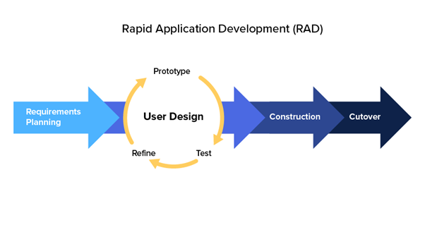
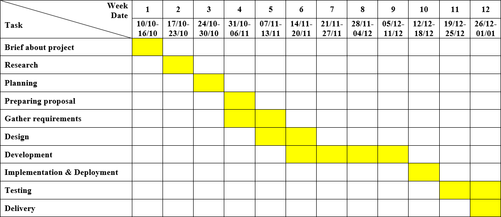

## Requirements for Group Project

[Read the instruction](https://github.com/STIW3054-A211/e-sulam/blob/main/GroupProject.md)

## Group Info:

|             Name             | Matric No |  Phone Number   |  Role  |                   Image                   |
| :--------------------------: | :-------: | :-------------: | :----: | :---------------------------------------: |
|         Tan Yi Qing          |  270607   |  +60103373137   | Leader |      |
| Ilham Muslim Maulana Rachmat |  268954   | +62895612852200 | Member |  |
|         Tan Jia Earn         |  269509   |  +60174422928   | Member |    |
|        Wong Fang Man         |  271221   |  +60164497347   | Member |    |
|         Ng Shen Meng         |  271059   |  +60193510295   | Member |    |

## Introduction

At the end of each year in Malaysia, monsoons cause frequent occurrences of natural disasters and cause floods. In addition, property loss of residents is inevitable. In response, penghulu in the district formed a post-disaster rescue team to solve the difficulties of the residents. However, with the current methods in black and white, rescue operations cannot be effective and carried out quickly. In this era of advanced technology, a system can be developed to help Penghulu and the residents to solve all their difficulties.

Pusat Kawalan Operasi Bencana (PKOB) is a centralized system that can help the penghulu of a district quickly engage in post-disaster relief operations. This system not only can assist the victims quickly but also avoid the phenomenon of wasting resources. The centralized victims’ data and assistance records can help penghulu to respond faster and trace back the records. Besides that, victims can also apply for assistance through the online method, this saves effort and time compared to the traditional black and white method.

## Problem Statement

Under the current situation, post-disaster rescue operations have encountered various difficulties. One of the problems is that the victims cannot get assistance in time. Using the current black and white method, assistance cannot be delivered to the victim in a very fast time because the management needs time to process the data and assign the type of assistance to the victim.

Secondly, a family gets a lot of the same help, which is also one of the common problems that lead to uneven distribution of resources. This is because data and records are not centrally or regularly arranged, so the cost of post-disaster rescue operations may be as high as twice, which also leads to a waste of resources.

The victim's data and records are incomplete. This led to inaccurate positioning of rescue operations after the disaster. This also made penghulu unable to have complete information about the victims, and it became impossible to trace back to the previous record.

These problems are critical because they can cause inefficiency of operation and raise costs. The cost from the aspect of time and money of post-disaster relief operations in the current situation can reach up to twice as high because of inefficiency, inaccuracy, and uncentralized data which may cause duplication of assistance given.

## Objectives

The objectives of this project are to:

<ul>
    <li>To analyse requirements for Pusat Kawalan Operasi Bencana (PKOB)</li>
    <li>To design a web-based application to centralized record</li>
    <li>To develop a web-based application to centralized record</li>
    <li>To evaluate a web-based application to centralized record</li>
</ul>

## Project Scope

The development time of the PKOB system is from October 2021 to January 2022. This system is a web application as the main platform, Heroku as a web server, and TelegramBot as the auxiliary. This system will be managed by penghulu, and the target users are victims. The system will store all the information of the victims, the record of assistance, and so on. The function of this system is that penghulu can key in data, update the progress. Beside that, victims can apply for many assistance. The type of assistance that can apply is house repair, new house, monthly assistance and food supply. When the penghulu updates the progress, victims will be notified. The main purpose of developing this application is that penghulu can efficiently retrieve information and avoid data duplication. Second, the data can be read clearly and easily.

## Project Significance (Impact to Community)

The significance of this project is that the PKOB system is more efficient and more efficient than the traditional black and white method. PKOB can replace the existing traditional black and white method because all data of victims and assistance records will be centralized which can help penghulu to respond faster and traceback easily. In addition, this system can effectively avoid data duplication. This can prevent those who use loopholes to obtain more benefits, resulting in other people not being able to enjoy the right to aid. Then, the PKOB system also provides an online request function, which allows victims to obtain the assistance they really need and save time. With these, a series of problems will also be solved such as wasting resources and reaching to help victims quickly.

## Project Methodology

Rapid Application Development (RAD) is a development methodology that emphasizes rapid prototyping and feedback over lengthy development and testing cycles.

1. Define the requirements

   The rapid application development cycle begins with stakeholders defining a loose set of project requirements. Requirements include goals, expectations, timelines, and budget. The client provides a vision and explains the problem in the existing method for PKOB. This stage seeks for a broad requirement for the system.

2. Prototype

   After having a broad requirement and the project of PKOB has been scoped, our team will begin developing prototypes with certain main features as fast as possible which later will be shown to the client. This is to ensure the client’s needs are being met.

3. Construction

   Rapid construction is where application coding, system testing, and unit integration occurs, converting prototype and beta systems into a working model. Team works with the client to collect feedback on interface and functionality and improve all aspects of the PKOB system. At this stage we refine the prototype and make it ready to deliver. All kinds of required modifications and enhancements are made in phase. 4. Cutover

4. Cutover

   The final phase is where development teams move components to a live production environment, where any necessary full-scale testing or training can take place. In this case, the system of PKOB will be accessible for the public to be used.

## Cost Estimation

| 

                             | Units/Hrs//Year       | Cost/Unit/Hr/Year               | Subtotals | Totals  | % of Total |
| :--------------------------------------------------------- | :-------------------: | :------------------------------:| :-------: | :-----: | :--------: |
| **1. Project Management**                                  |                       |                                 |           | RM10030 | 41%        |
| Project manager Project team members                   | 180 720           | RM15 RM10|RM2700 RM7200 |           |         |            |
| Contractors (10% of software development and testing)      |                       |                                 | RM200     |         |            |
| **2. Hardware**                                            |                       |                                 |           | RM90    | 1%         |
| 2.1 Handheld devices                                       | -                     | -                               | -         |         |            |
| 2.2 Servers (Cpanel)                                       | 1                     | RM90                            | RM90      |         |            |
| **3. Software**                                            |                       |                                 |           | RM1050  | 4%         |
| 3.1 Licensed software                                      | 1                     | RM50                            | RM50      |         |            |
| 3.2 Software development                                   |                       |                                 | RM1000    |         |            |
| **4. Testing (10% of total hardware and software costs)**  |                       |                                 | RM1000    | RM1000  | 4%         |
| **5. Training and Support**                                |                       |                                 |           | RM7700  | 32%        |
| Trainee cost                                               | 100                   | RM5                             | RM500     |         |            |
| Travel cost                                                | -                     | -                               | RM500     |         |            |
| Project team members                                       | 720                   | RM10                            | RM7200    |         |            |
| **6. Reserves (20% of total estimate)**                    |                       |                                 |           | RM3988  | 17%        |
| Total project cost estimate                                |                       |                                 |           | RM23928 | 100%       |

## Gantt Chart

## File Structure for Telegram Bot

## File Structure for Web Application

## Database Design

## Project Limitation

## Conclusion

## Youtube Presentation

## Facebook

## Number of Issues

## List of Python packages (including the version) used for this system

## References (Not less than 30)
