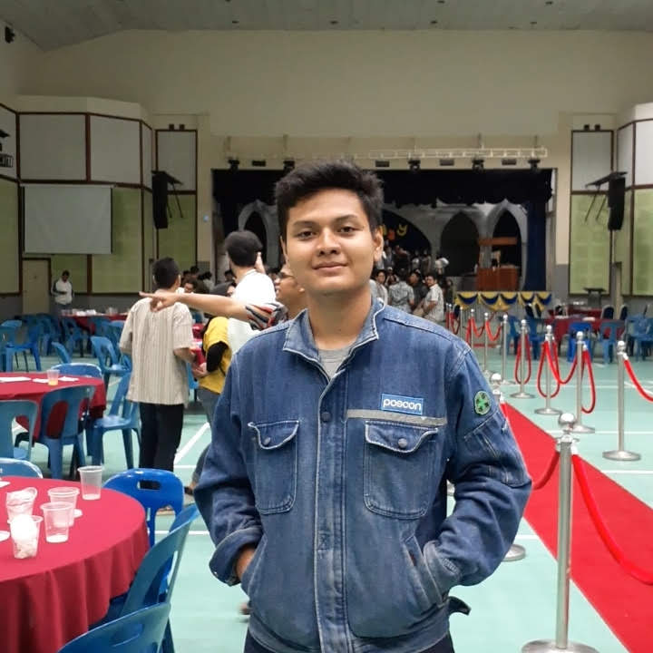
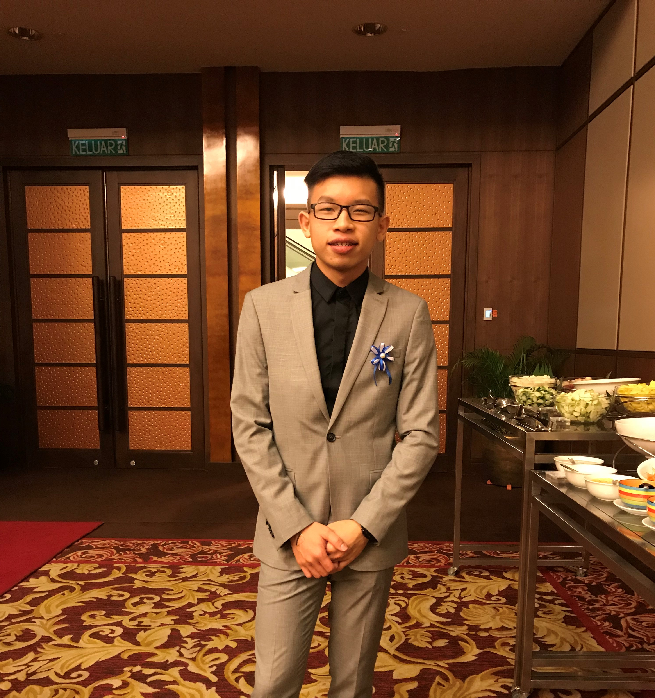

## Requirements for Group Project

[Read the instruction](https://github.com/STIW3054-A211/e-sulam/blob/main/GroupProject.md)

## Group Info:

|             Name             | Matric No |  Phone Number   |  Role  |                   Image                   |
| :--------------------------: | :-------: | :-------------: | :----: | :---------------------------------------: |
|         Tan Yi Qing          |  270607   |  +60103373137   | Leader |      |
| Ilham Muslim Maulana Rachmat |  268954   | +62895612852200 | Member |  |
|         Tan Jia Earn         |  269509   |  +60174422928   | Member |    |
|        Wong Fang Man         |  271221   |  +60164497347   | Member |    |
|         Ng Shen Meng         |  271059   |  +60193510295   | Member |    |

## Introduction

## Problem Statement

## Objectives

## Project Scope

## Project Significance (Impact to Community)

## Project Methodology

## Cost Estimation

## Gantt Chart

## File Structure for Telegram Bot

## File Structure for Web Application

## Database Design

## Project Limitation

## Conclusion

## Youtube Presentation

## Facebook

## Number of Issues

## List of Python packages (including the version) used for this system

## References (Not less than 30)
