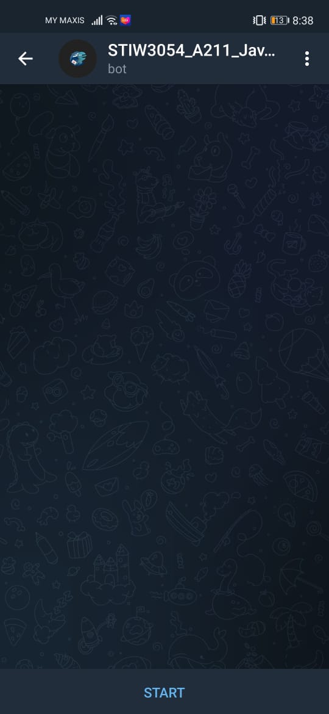
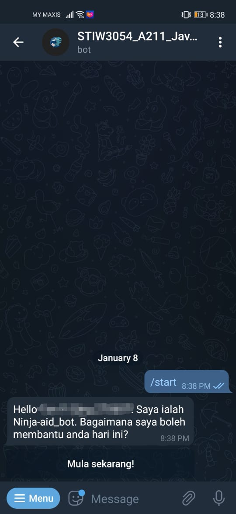
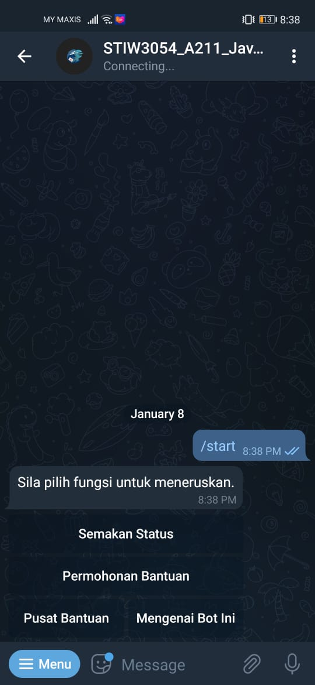
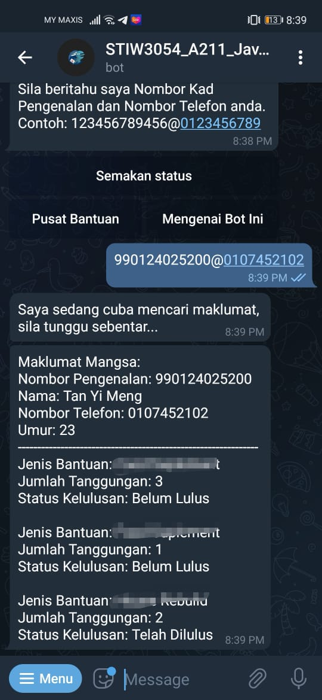
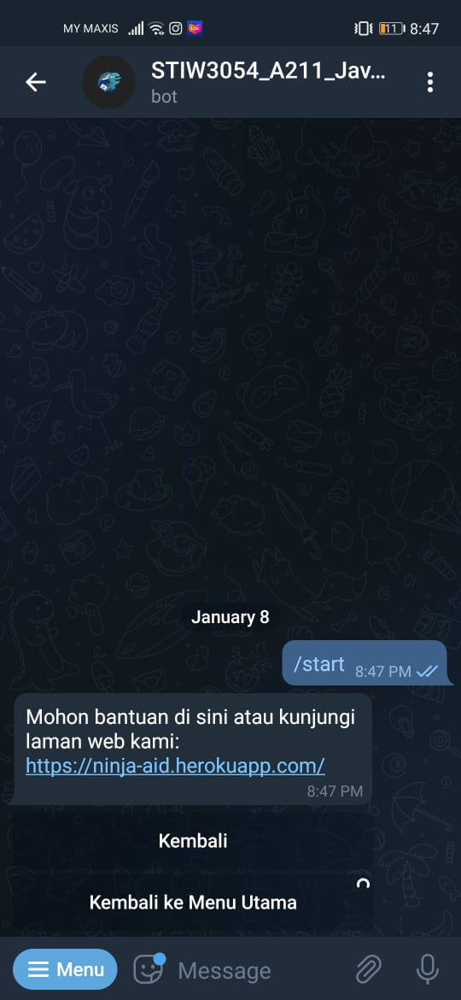

## User Manual Telegram Bot
##1. Step 1
 
User can search STIW3054_A211_JavaFive_bot to access our bot. This will be the page shows when user enter into our bot. Our bot provide user to check their application status, apply assistance and so on.

##2. Step 2
 
To activate this bot, user need to press the start button. This bot will greet users and user need to press "Mula Sekarang" to view actions that can be perform.

##3. Step 3
 
This is the menu shows when user press "Mula Sekarang".

##4. Step 4
 
To check the appliance status, user can click "Semakan Status". In this page, user need to insert their IC number and phone number to check the status. The input format should be IC Number@Phone Number. Example: 123456789102@0123456789

##5. Step 5
 
To apply for assistance, user need to visit our website. User can click on that link to redirect to our website.

## YouTube Presentation
