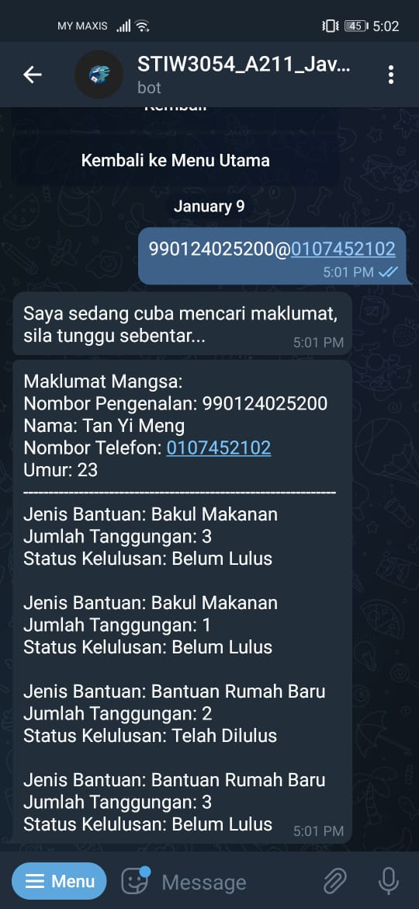

## User Manual Website
## Victim Part
## 1. Step 1
 

First, victim can go to this website url https://ninja-aid.herokuapp.com/victim/victimdashboard/ to redirect to page than can enable victim to check their application status and even apply for status if they want.
At here, victim can check their application status using this format: IC Number@Phone Number. Example 123456789012@0123456789

## 2. Step 2
 

When victim enter the correct information, system will display the details of victim application on assistance. At here, victim can edit their application or add assistance request.

## Admin Part (Penghulu)
## 1. Step 1
 

When admin enter the website, this will be the first page show by Ninja-Aid. Admin need to register if he did not have an account or login with his account.

a. Register Page
 

Admin need to input all the field required and also the referral code that enhance the secureness.

b. Login Page
 

Admin need to login with the correct IC Number and password.

## 2. Step 2
 

This is the landing page when admin login. This will show a dashboard and analysis of victim details.

## 3. Step 3
 

To add assistance for victim, admin can click on "Tambah Butiran Mangsa" and system will redirect to this page. Admin need to key in or the required fields.

## 4. Step 4
 

To view victim list, admin can click on "Senarai Butiran Mangsa". This page will show the victim list, and admin can perform many actions such as view victim assistance, edit victim details, delete victim, and add assistance.

a. View Victim Assistance
 

Admin can determine whether he want to approve the assistance.

b. Edit Victim Details
 

Admin need to input all the fields required and needed to edit.

d. Add Assistance
 

Admin need to select the assistance type to be apply.

## User Manual Telegram Bot
## 1. Step 1
 

User can search STIW3054_A211_JavaFive_bot to access our bot. This will be the page shows when user enter into our bot. Our bot provide user to check their application status, apply assistance and so on.

## 2. Step 2
 

To activate this bot, user need to press the start button. This bot will greet users and user need to press "Mula Sekarang" to view actions that can be perform.

## 3. Step 3
 

This is the menu shows when user press "Mula Sekarang".

## 4. Step 4
 

To check the appliance status, user can click "Semakan Status". In this page, user need to insert their IC number and phone number to check the status. The input format should be IC Number@Phone Number. Example: 123456789102@0123456789

## 5. Step 5
 

To apply for assistance, user need to visit our website. User can click on that link to redirect to our website.

## YouTube Presentation
